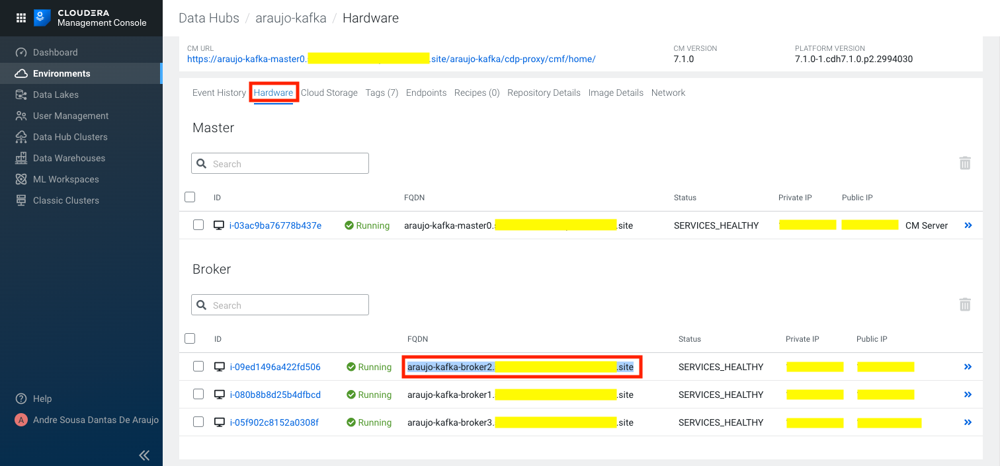

= Getting Started with Kafka on CDP Public Cloud

*Table of Contents*

* <<ensuring-prerequisites, Ensuring prerequisites>>
* <<creating-a-kafka-cluster, Creating a Kafka cluster>>
* <<creating-a-machine-user, Creating a Machine User>>
* <<granting-the-machine-user-access-to-the-environment, Granting the Machine User access to the Environment>>
* <<creating-kafka-topics, Creating Kafka Topics>>
* <<creating-ranger-policies, Creating Ranger policies>>
* <<producing-data-to-a-topic, Producing data to a topic>>
* <<consuming-data-from-a-topic, Consuming data from a topic>>
* <<using-kerberos-authentication, Using Kerberos authentication>>
* <<monitoring-kafka-activity-in-smm, Monitoring Kafka activity in SMM>>
* <<using-schema-registry, Using Schema Registry>>
* <<monitoring-end-to-end-latency, Monitoring end-to-end latency>>
* <<evolving-your-schema, Evolving your schema>>

The purpose of this document is to walk you through the implementation of a simple use case to demonstrate the concepts and use of Kafka on CDP Public Cloud.

In this example we will use a simple application (vmstat) to generate some raw text data and a `kafka-console-producer` to send the data to a Kafka topic. We'll also use a `kafka-console-consumer` read data from that topic. Once we have the producer and consumer running we will use CDP's Stream Messaging Manager to monitor what is happening.

Besides sending text data to a Kafka topic we would also like to structure it in an object and send it to Kafka in Avro format. To do this we'll store a schema in CDP's Schema Registry and look how to use a simple Java Kafka client to send and read data using that schema.

[[ensuring-prerequisites]]
== Ensuring prerequisites

Follow instructions in Cloudera's online documentation to ensure you link:https://docs.cloudera.com/cdf-datahub/7.1.0/quick-start-sm/topics/cdf-datahub-sm-cluster-quick-start-prereq.html[meet the prerequisites] for this tutorial on your CDP environment.

Please note that, as stated in the prerequisites document above, your user *must* have the _EnvironmentAdmin_ role. This is required so that you have admin privileges on Kafka and Ranger to perform the tasks in this tutorial. If you don't have this role, please ask for assistance of your environment's admin.

[[creating-a-kafka-cluster]]
== Creating a Kafka cluster

To complete this tutorial we will need a running Kafka cluster on CDP. Follow instructions in Cloudera's online documentation to link:https://docs.cloudera.com/cdf-datahub/7.1.0/quick-start-sm/topics/cdf-datahub-sm-cluster-quick-start-createcluster.html[create your Kafka cluster].

[[creating-a-machine-user]]
== Creating a Machine User

Since you have your own personal user to connect to CDP, we could use it for all the examples in this tutorial. However, in real production use cases we typically create a dedicated service account to use ingestion processes or pipelines. So, instead of using your own account, we'll do the same here.

link:https://docs.cloudera.com/management-console/cloud/user-management/topics/mc-machine-user.html[Machine User] is the CDP nomenclature for a "service account". To create one, follow the steps below:

. Navigate to *Management Console > User Management*.
. Click *Actions > Create Machine user*.
. Enter a unique name for the user and click *Create*.
. Once the user gets created you will see a page like the following one with the user details. Note the _Workload User Name_ (`srv_kafka-client`, in the example below), which is different from the actual user name (`kafka-client`). The Workload User Name is the identifier we'll use to configure the access for our workload/application a little later.
+

. Click on *Set Workload Password* and follow the prompts to set a password for the Machine User. Leave the Environment field empty.

[[granting-the-machine-user-access-to-the-environment]]
== Granting the Machine User access to the Environment

Before we can use this Machine User to access the Kafka cluster we must link:https://docs.cloudera.com/cdf-datahub/7.1.0/quick-start-sm/topics/cdf-datahub-sm-cluster-quick-start-giveaccess.html[grant the user access] to the environment that contains the cluster. Follow the detailed steps below to accomplish this:

. Navigate to *Management Console > Environments*, and select the environment where your Kafka cluster is.
. Click *Actions > Manage Access*.
. On the search box, type the name of the Machine User and select it.
. Check the box for the *EnvironmentUser* role and click *Update Roles*.
+

. Go back to the environment page and click *Actions > Synchronize Users to FreeIPA*, to ensure that the role assignment is in effect for the environment. On the Sync Users page, click the *Sync Users*  button.
+

[[creating-kafka-topics]]
== Creating Kafka Topics

We will create two Kafka topics to use in the tutorial:

* `machine-data` : topic containing machine usage data in free text format
* `machine-data-avro` : topic containing machine usage data in Avro format

To create the topics, follow the steps below:

. Navigate to *Management Console > Environments*, and select the environment where your Kafka cluster is.
. On the *Data Hubs* tab of your environment, select the Kafka cluster you created above.
. Click *Streams Messaging Manager* (SMM) on the Services pane to open the SMM web UI.
+
SMM is CDP's tool to monitor and manage Kafka. We will use it here to create the topics we need.
. On the SMM UI, click the *Topics* tab ().
. Click the *Add New* button.
. Enter the following details for the topic and click *Save* when ready:
.. Topic name: `machine-data`
.. Partitions: `10`
.. Availability: `Maximum`
.. Cleanup Policy: `delete`
. Click the *Add New* button again to add a second topic.
. Enter the following details for the new topic and click *Save* when ready:
.. Topic name: `machine-data-avro`
.. Partitions: `10`
.. Availability: `Maximum`
.. Cleanup Policy: `delete`
. Still on the SMM Topics page, type "machine" on the search field to filter the topics shown on the screen. You should now see both topics you created above:
+

[[creating-ranger-policies]]
== Creating Ranger policies

Since your personal user is an environment admin, you already have privileges to access and modify topics on Kafka. This is not the case, though, for the Machine User account we created above.

Authorization policies in CDP are maintained and enforced by Apache Ranger. To learn more about Apache Ranger, please check the online documentation on link:https://docs.cloudera.com/runtime/7.1.0/security-ranger-authorization/index.html[using Ranger to Provide Authorization in CDP].

To allow the Machine User account to read from and write data to the topics we just created it is necessary that we define new access policies for those topics in Ranger. We'll need 2 policies:

* One _Topic_ policy to grant access to the two topics we created
* One _Consumer Group_ policy to define which consumer groups the Machine User can use to consume data from the topics.

First let's create the topic policy:

. Navigate to *Management Console > Environments*, and select the environment where your Kafka cluster is.
. Click the *Ranger* icon () on the top pane, to open the Ranger web UI.
. On the Ranger UI, click *Access Manager > Resource Based Policies*
. Under the *KAFKA* group, select the policy of your Kafka cluster. To select it, click on the _policy name_, *not* on the icons.
. You should see the list of pre-defined policies for your Kafka cluster:
+

. Click *Add New Policy*, to create a new one, and enter the following details:
.. Policy Name: `Machine Data topics`
.. *Topic*: `machine-data*`
.. Description: `All topics prefixed with machine-data`
. Under the *Allow Conditions* section, click on the empty *Select Users* box and select the Machine User you created previously.
. Click *Add Permissions*, and select the following permissions and click on the *tick mark* button when ready: `Publish`, `Consume`, `Describe`
+

. Scroll to the bottom of the page and click the *Add* button to save the policy.

Now, create the consumer group policy:

. Click *Add New Policy*, to create a new one, and enter the following details:
.. Policy Name: `Machine Data consumer groups`
.. *Consumer group*: `machine-data*`
.. Description: `All consumer groups prefixed with machine-data`
. Under the *Allow Conditions* section, click on the empty *Select User* box and select the Machine User you created previously. You can type the name of the user to filter the list of users. Also note that the user name appears with the `srv_` prefix, indicating that it is a Machine User.
. Click *Add Permissions*, and select the following permissions and click on the *tick mark* button when ready: `Consume`, `Describe`
+

. Scroll to the bottom of the page and click the *Add* button to save the policy.

Now you should see your new policies listed in Ranger. That means that your Machine User is ready to start using it. So let's look at how we can start producing data to that topic!

[[producing-data-to-a-topic]]
== Producing data to a topic

The applications that will produce to or consume data from Kafka can run on any servers on your network, provided they have connectivity to the Kafka cluster in CDP. These applications should *not* be executed on the hosts of the Kafka cluster, since this could affect the Kafka operation.

In this step of the tutorial, though, we will use the `kafka-console-producer` command line application, which is already installed on the Kafka hosts, so that we can understand the necessary application configuration first, without having to build an application for it. In a later step we will look at configuring and running an application on a separate host to connect to the cluster.

If you haven't set your personal Workload Password yet, this is a good time to do so:

. Click *Profile* in your user menu on the CDP console:
+

. On your profile page, click *Set Workload Password* and follow the prompts to set a password for your user. Leave the Environment field empty.

Once your Workload Password is set, let's connect to one of the Kafka hosts:

. Navigate to *Management Console > Environments*, and select the environment where your Kafka cluster is.
. On the *Data Hubs* tab of your environment, select the Kafka cluster you created above.
. On the Kafka cluster page, click on the *Hardware* tab and choose one of the Kafka brokers to use for running your producer test. Select and copy the full hostname of the broker your chose:
+

. Using the SSH client of your preference, connect to that broker host, using *your* CDP user and *your* workload password for authentication. For example, if connecting from a Terminal, you can use:
+
[source,shell]
----
ssh <your_user_name>@<broker_host_name>
----

All the Kafka clusters created in CDP are secure. This means that TLS is enabled to encrypt communications between clients and the cluster, and strong authentication is enforced, requiring client to authenticate either through Kerberos or LDAP.

In this example we will use LDAP authentication. We need to provide the client with the following parameters:

* `security.protocol` and `sasl.mechanism` - indicate to the client the security protocol and authentication mechanism to use
* `ssl.truststore.location` - truststore required for the client to be able to trust the brokers' certificates
* `sasl.jaas.config` - LDAP credentials to use for authentication

All the Kafka hosts deployed by CDP already have a valid truststore deployed at `/var/lib/cloudera-scm-agent/agent-cert/cm-auto-global_truststore.jks`. We will use this truststore in this example. Later we will look at how to create a truststore from scratch.

Please check the CDP online documentation for a detailed explanation on how to configure link:https://docs.cloudera.com/runtime/7.1.0/kafka-securing/topics/kafka-secure-tls-clients.html[TLS] and link:https://docs.cloudera.com/runtime/7.1.0/kafka-securing/topics/kafka-secure-ldap-client.html[LDAP authentication] for Kafka clients.

Let's produce some data to Kafka. Execute the following steps on your SSH session:

. Create a file called `client-ldap.properties` with the following content
+
[source,python]
----
security.protocol=SASL_SSL
sasl.mechanism=PLAIN
ssl.truststore.location=/var/lib/cloudera-scm-agent/agent-cert/cm-auto-global_truststore.jks
sasl.jaas.config=org.apache.kafka.common.security.plain.PlainLoginModule required username="srv_kafka-client" password="SuperSecretPassword";
----
. IMPORTANT: Since the file above contains sensitive information, ensure that its permissions are set restrictively:
+
[source]
----
chmod 400 client-ldap.properties
----
. With this configuration we can already start running Kafka client applications. First, let's try to list all the topics that the Machine User has access to, to ensure everything is set up correctly. Run this command:
+
[source,shell]
----
BROKER_HOST=$(hostname -f)

kafka-topics \
  --bootstrap-server $BROKER_HOST:9093 \
  --command-config client-ldap.properties \
  --list
----
+
The output include _lots_ of `INFO` lines, but you should see the two topics we created previously at the end of the output:
+
[source]
----
machine-data
machine-data-avro
----
+
If you don't, please go back and review the previous steps. Otherwise, you can continue to the next step.
. To produce a simple text message to the Kafka topic, we can use the `kafka-console-producer`. Run the following command:
+
[source]
----
echo 'Hello, Kafka!' | kafka-console-producer \
  --broker-list $BROKER_HOST:9093 \
  --producer.config client-ldap.properties \
  --topic machine-data
----
+
If the output of the command above contains only `INFO` lines and *no* `ERROR` lines, it is a good indication that data was produced correctly to the Kafka topic.

In the next section we will use the `kafka-console-consumer` to verify the contents of the Kafka topic.

[[consuming-data-from-a-topic]]
== Consuming data from a topic

The configuration that we used previously to produce data to the topic is the same we will use to consume data. Run the steps below to verify that the data was written correctly to the topic and can also be read by the client:

. Run the following command to consume the data produced previously:
+
[source]
----
kafka-console-consumer \
  --bootstrap-server $BROKER_HOST:9093 \
  --consumer.config client-ldap.properties \
  --topic machine-data \
  --group machine-data-1 \
  --from-beginning
----
+
You should see the data below shown in the output, which tells us that the client successfully read it from the topic:
+
[source]
----
Hello, Kafka!
----

NOTE: If you re-run the same command, reusing the consumer group name (`machine-data-1` in the example above) the data will not be shown because the client will continue from where it left off in the previous execution. If you want to read the data again, change the group name to something else (e.g. `machine-data-2`)

[[using-kerberos-authentication]]
== Using Kerberos authentication

In the examples above we configured the Kafka client to authenticate using LDAP authentication. LDAP authentication is generally easier to configure for remote clients, since it doesn't require Kerberos libraries/clients to be installed and the remote clients don't need direct connectivity to your Kerberos or LDAP server.

In some situations, though, Kerberos authentication may be required and/or preferred. In this section we'll run the same `kafka-console-consumer` command we used before but this time using Kerberos authentication to demonstrate the required configuration.

When using Kerberos we can use two different sources for the authentication credentials: a _ticket cache_ or a _keytab_. The ticket cache is where the Kerberos ticket for a user is stored _after_ the user authenticates successfully. The ticket cache can only be used when the user has already authenticated previously (using a username and password). The keytab is a special (and _sensitive_) file that contains the user credentials. Keytabs don't require that the user authenticates previously.

In this example we will create a new configuration file, called `client-kerberos.properties` or `client-keytab.properties`, depending on the credentials source we use. These configuration files are similar to the `client-ldap.properties` one that we used in the previous example but with Kerberos-specific parameters.

Please check the CDP online documentation for more details on link:https://docs.cloudera.com/runtime/7.1.0/kafka-securing/topics/kafka-secure-kerberos-enable.html[Kerberos authentication configuration] for Kafka clients.

=== Using the ticket cache

Run the following steps in your SSH session:

. Create a file called `client-kerberos.properties` with the following content:
+
[source,python]
----
security.protocol=SASL_SSL
sasl.mechanism=GSSAPI
sasl.kerberos.service.name=kafka
ssl.truststore.location=/var/lib/cloudera-scm-agent/agent-cert/cm-auto-global_truststore.jks
sasl.jaas.config=com.sun.security.auth.module.Krb5LoginModule required useTicketCache=true;
----
. Before connecting to Kafka you first need to authenticate successfully with Kerberos to acquire a valid Kerberos ticket. You can use `kinit` for that. Run the commands below, replacing `srv_kafka-client` with your Machine User name. When prompted for the password, provide the Workload Password that you set previously.
+
[source,shell]
----
kdestroy

kinit srv_kafka-client
----
. If the command was successful, you should have a valid ticket in your ticket cache, as shown by the command `klist`, shown below:
+
[source]
----
$ klist
Ticket cache: FILE:/tmp/krb5cc_1501600556
Default principal: srv_kafka-client@XYZ.SITE

Valid starting       Expires              Service principal
05/07/2020 03:10:58  05/08/2020 03:10:52  krbtgt/XYZ.SITE@XYZ.SITE
	renew until 05/14/2020 03:10:52
----
+
Is the command was not successful, your ticket cache should be empty, as shown in the example below:
+
[source]
----
$ klist
klist: No credentials cache found (filename: /tmp/krb5cc_1501600556)
----
. Once you have a valid ticket in the ticket cache you can run the commands below to connect to Kafka, authenticating with the Kerberos ticket that is stored in the cache.
+
[source]
----
BROKER_HOST=$(hostname -f)

kafka-console-consumer \
  --bootstrap-server $BROKER_HOST:9093 \
  --consumer.config client-kerberos.properties \
  --topic machine-data \
  --group machine-data-$RANDOM \
  --from-beginning
----
+
You should again see the contents of the `machine-data` topic shown on the screen.
+
[source]
----
Hello, Kafka!
----
. Once you're done with your testing, destroy the ticket in your ticket cache with the command:
+
[source]
----
kdestroy
----
. If you try to run the `kafka-console-consumer` again, without the ticket, you'll see authentication errors like the one below:
+
[source]
----
Caused by: javax.security.auth.login.LoginException: Could not login: the client is being asked for a password, but the Kafka client code does not currently support obtaining a password from the user. not available to garner  authentication information from the user
----

=== Using the keytab

As mentioned previously, instead of using a ticket from the ticket cache we can also authenticate using a keytab. Let's see how that works:

. Navigate to *Management Console > User Management*.
. Select the *Machine User* you created previously.
. Click *Actions > Get Keytab*.
. On the *Get Keytab* dialog box, select the environment where the Kafka cluster is and click *Download*.
. Copy the keytab that was downloaded on your computer to the broker host you were connected to.
. *IMPORTANT*: Since the keytab file contains sensitive information, ensure that its permissions are set restrictively:
+
[source]
----
chmod 400 ./kafka-client.keytab
----
. Create the `client-keytab.properties` file with the following contents:
+
[source,python]
----
security.protocol=SASL_SSL
sasl.mechanism=GSSAPI
sasl.kerberos.service.name=kafka
ssl.truststore.location=/var/lib/cloudera-scm-agent/agent-cert/cm-auto-global_truststore.jks
sasl.jaas.config=com.sun.security.auth.module.Krb5LoginModule required useKeyTab=true keyTab="./kafka-client.keytab" principal="srv_kafka-client@XYZ.SITE";
----
+
Where the value of the `keyTab` property is the path of the keytab copied to the host and the value of the `principal` property is the Kerberos principal name of the Machine User account. You can find the principal name by listing the contents of the keytab, as shown below:
+
[source]
----
$ klist -kt ./kafka-client.keytab
Keytab name: FILE:kafka-client.keytab
KVNO Timestamp           Principal
---- ------------------- ------------------------------------------------------
   0 05/07/2020 03:32:01 srv_kafka-client@XYZ.SITE
   0 05/07/2020 03:32:01 srv_kafka-client@XYZ.SITE
----
. Run the commands below to connect to Kafka, authenticating with the Kerberos keytab.
+
[source]
----
BROKER_HOST=$(hostname -f)

kafka-console-consumer \
  --bootstrap-server $BROKER_HOST:9093 \
  --consumer.config client-keytab.properties \
  --topic machine-data \
  --group machine-data-$RANDOM \
  --from-beginning
----
+
Once more, you should see the contents of the `machine-data` topic shown on the screen.
+
[source]
----
Hello, Kafka!
----

[[monitoring-kafka-activity-in-smm]]
== Monitoring Kafka activity in SMM

Now that we know how to configure a Kafka client to connect to the Kafka cluster in CDP, let's generate some activity and monitor it using SMM. For this we will collect machine usage data from the broker host using the command `vmstat` and stream that data into the `machine-data` topic.

For more detailed and comprehensive information about Streams Messaging Manager, please check the CDP link:https://docs.cloudera.com/cdf-datahub/7.1.0/howto-streams-messaging-manager.html[online documentation].

. Start by opening 2 SSH connections to the same broker host.
. On the first session, run the command below. This example assumes we're using LDAP authentication, as explained previously, but you can use the authentication method of your preference)
+
[source]
----
BROKER_HOST=$(hostname -f)

vmstat 1 1000 | kafka-console-producer \
  --broker-list $BROKER_HOST:9093 \
  --producer.config client-ldap.properties \
  --topic machine-data
----
+
This command will run `vmstat` and send each line from its output as a message to the `machine-data` topic, one each second.
. Leave this command running.
. On the second SSH session, run the following command to consume the data:
+
[source]
----
BROKER_HOST=$(hostname -f)

kafka-console-consumer \
  --bootstrap-server $BROKER_HOST:9093 \
  --consumer.config client-ldap.properties \
  --topic machine-data \
  --group machine-data-$RANDOM \
  --from-beginning
----
+
You should see the data produced by the first session being continuously output to the screen. Leave this session also running.
. Navigate to *Management Console > Environments*, and select the environment where your Kafka cluster is.
. On the *Data Hubs* tab of your environment, select the Kafka cluster you created above.
. Click *Streams Messaging Manager* (SMM) on the Services pane to open the SMM web UI.
. It make take a few minutes for the consumer/producer activity to start showing in the SMM UI. You may have to refresh your page a few times until the data starts to appear.
. Once it does you will see one active producer on the left-hand side of the page and at least one active consumer listed on the right-hand side.
+

+
NOTE: SMM shows as active consumer and producers that showed some activity in the last few minutes. Because of this, you may still see as active, producers and consumers that finished recently.
. Note the *LAG* metrics listed besides each consumer. This metric tells by how many messages the consumer is behind the latest message produced to the topic it is consuming from. You can use this to quick identify slow consumers that are lagging far behind producers.
. Click either on the producer or on the consumer, and SMM will show their activity, highlighting all the topics and partitions they are writing to or reading from, respectively.
+

+
In this page you'll be able to identify metrics for the overall topic activity as well as partition-level metrics.
+
Note that the In Sync Replica (ISR) Set for each partition can be identified on the screen. The ID of the LEADER replica for each partition is shown on the left-hand side, while the FOLLOWER replicas are represented as teal-colored boxes on the right-hand side.
. Click on an empty part of the page to clear the consumer/producer selection, and then click on the *profile icon* () for the `machine-data` topic. This will open the topic details page where you can find all the topic-related metrics and utilization charts.
+

. Click the *DATA EXPLORER* tab. In the Data Explorer page you can sample the data that is flowing through the topic. Select different partitions and play with the offset sliders to become familiar with those controls.
+

[[using-schema-registry]]
== Using Schema Registry

Schema Registry provides a shared repository of schemas that allows applications to flexibly interact with each other. Applications frequently need a way to share metadata across data format, schema, and semantics. Schema Registry addresses these challenges by evolving schemas such that a producer and consumer can understand different versions of the schemas but still read all information shared between both versions and safely ignore the rest.

In this section we will use a sample Kafka client application, written in Java, to produce and consume to Kafka using schemas stored in Schema Registry.

For more information on the topics covered in this section, please check the following Cloudera online documentation resources:

* link:https://docs.cloudera.com/cdf-datahub/7.1.0/connecting-kafka/topics/kafka-dh-connect-clients-outside-vpc.html[Connecting Kafka clients to Data Hub provisioned clusters]
* link:https://docs.cloudera.com/cdf-datahub/7.1.0/howto-schema-registry.html[Schema Registry]
* link:https://docs.cloudera.com/cdf-datahub/7.1.0/howto-schema-registry.html[Developing Apache Kafka Applications]

IMPORTANT: In this section we will build a sample Java application. In order to be able to do this you must have the following installed on your local computer: *Java 8 SDK* (or later), *Maven* and *Git*.

IMPORTANT: The sample code included in this repository works on Linux and MacOS. It may have to be modified if you are using a different OS.

=== Gathering configuration information

Besides the Machine User name and password that we used in previous examples, we will also need the following additional information to configure the client application:

* *Broker list* - since this is a remote application (running on your computer) we need to configure it with a list of brokers to which they can connect.
* *Schema Registry endpoint* - we also need to provide the application with the Schema Registry endpoint so that the application can store and retrieve schemas from it.
* *TLS truststore* - since this is a remote application connecting to a secure CDP cluster, for which TLS encryption is enabled, we need to provide the client with a truststore that is can use to validate the cluster certificates in order to establish secure communication channels.

==== Broker list

To find the list of brokers of your Kafka cluster follow the steps below:

. Navigate to *Management Console > Environments*, and select the environment where your Kafka cluster is.
. On the *Data Hubs* tab of your environment, select the Kafka cluster you created above.
. Click *Streams Messaging Manager* (SMM) on the Services pane to open the SMM web UI.
. On the SMM UI, click the *Brokers* tab ().
. Take note of the broker endpoints (host and port) listed on the Brokers page.
+

+
NOTE: If your cluster has more than 3 brokers you typically only need to provide the client with a sample of them. Pick only 3 of them.

==== Schema Registry endpoint

To find the Schema Registry endpoint follow the steps below:

. Navigate to *Management Console > Environments*, and select the environment where your Kafka cluster is.
. On the *Data Hubs* tab of your environment, select the Kafka cluster you created above.
. Click the *Endpoints* tab and take note of the Schema Registry endpoint:
+

==== TLS truststore

The Kafka client will need a truststore to successfully connect to the secure Kafka cluster. Follow the steps below to create the truststore:

. Navigate to *Management Console > Environments*, and select the environment where your Kafka cluster is.
. Click *Actions > Get FreeIPA Certificate*. This will download the FreeIPA certificate file (`ca.crt`) to your computer.
. Run the following command to create the truststore:
+
[source,shell]
----
keytool \
  -importcert \
  -noprompt \
  -storetype JKS \
  -keystore truststore.jks \
  -storepass changeit \
  -alias freeipa-ca \
  -file /path/to/ca.crt
----

=== Defining Schema Registry access policies

Before our application can use Schema Registry we must grant it privileges by creating the appropriate policies in Ranger.

In our example we want to allow the application to create and manage schemas in Schema Registry. You can adjust the permissions granted to the applications in your environment to avoid granting privileges that are not necessary for each particular use case.

Follow the steps below:

. Navigate to *Management Console > Environments*, and select the environment where your Kafka cluster is.
. Click the *Ranger* icon () on the top pane, to open the Ranger web UI.
. On the Ranger UI, click *Access Manager > Resource Based Policies*
. Under the *SCHEMA REGISTRY* group, select the policy associated to your Schema Registry service. To select it, click on the _policy name_, *not* on the icons. You should see the list of pre-defined policies for your Schema Registry.
. Create a policy to allow access to the schema *metadata*:
.. Click *Add New Policy*, to create a new one, and enter the following details:
... Policy Name: `Machine Data Schema Metadata`
... *schema-group*: `kafka`
... Schema Name: `machine-data-avro`
... *schema-branch*: Click on the `schema-branch` option and select `none`
... Description: `Access to machine-data-avro schema metadata`
.. Under the *Allow Conditions* section, click on the empty *Select Users* box and select the Machine User you created previously.
.. Click *Add Permissions*, select all the permissions and click on the *tick mark* button when ready.
+
image::images/registry-service-permissions.png[width=101]
.. Scroll to the bottom of the page and click the *Add* button to save the policy.
. Create a policy to allow access to the schema *versions*:
.. Click *Add New Policy*, to create a new one, and enter the following details:
... Policy Name: `Machine Data Schema Versions`
... *schema-group*: `kafka`
... Schema Name: `machine-data-avro`
... *schema-branch*: `MASTER`
... *schema-version*: `*`
... Description: `Access to machine-data-avro schema versions`
.. Under the *Allow Conditions* section, click on the empty *Select Users* box and select the Machine User you created previously.
.. Click *Add Permissions*, select all the permissions and click on the *tick mark* button when ready.
+
image::images/registry-service-permissions.png[width=101]
.. Scroll to the bottom of the page and click the *Add* button to save the policy.

=== Producing data

To run the sample producer application follow these steps:

. On your own computer, clone this repo using `git` and change to the `kafka-client-avro` directory:
+
[source,shell]
----
git clone https://github.com/asdaraujo/cdp-examples
cd cdp-examples/kafka-client-avro
----
. Build the client binaries:
+
[source,shell]
----
mvn clean package
----
. Create a copy of the producer properties template file:
+
[source,shell]
----
cp src/main/resources/producer.properties.template producer.properties
----
. Edit the `producer.properties` file and replace the following placeholders with the respective values:
** `<MACHINE_USER_NAME>` - the Machine User name (prefixed with `srv_`). Note that this needs to be replaced at 2 locations in the template.
** `<MACHINE_USER_PASSWORD>` - the Machine User's Workload Password. Note that this needs to be replaced at 2 locations in the template.
** `<BROKER1>`, `<BROKER2>`, `<BROKER3>` - the hostnames of 3 cluster brokers. Also, ensure that the broker port numbers match the numbers seen on the Brokers page in SMM
** `<TRUSTSTORE_PATH>` - the path of the `truststore.jks` file created in the previous section.
** `<SCHEMA_REGISTRY_ENDPOINT>` - The Schema Registry endpoint, discovered in a previous section.
. The producer application (`MachineDataProducer` class) takes 2 arguments:
.. The `producer.properties` file
.. An Avro schema definition file that the producer will use to produce messages.
+
Run the producer application with the following command:
+
[source,shell]
----
java \
  -cp ./target/kafka-client-avro-1.0-SNAPSHOT.jar \
  com.cloudera.examples.MachineDataProducer \
  ./producer.properties \
  ./src/main/avro/MachineData.v1.avsc
----
+
If the producer is working correctly, you should see several messages like the one below:
+
[source]
----
... INFO  c.c.examples.MachineDataProducer - Successfully produced message to partition [machine-data-avro-8], offset [0]
----
. Leave the SSH session open and the producer running for now.

==== Note about serialization of Avro objects

If you browse the producer code, you will see that there is *no* need for explicit serialization of the Avro objects in the code. The objects are simply sent directly to the producer:

[source,java]
----
for (GenericData.Record data : new MachineDataCollector(schema)) {
    ProducerRecord<String, GenericData.Record> producerRecord =
        new ProducerRecord<>(topicName, data);
    producer.send(producerRecord, new ProducerCallback());
}
----
The serialization is handled automatically by the `KafkaAvroSerializer` class that we used to configure the Kafka client's `value.serializer` property in the properties file:

[source,properties]
----
value.serializer=com.hortonworks.registries.schemaregistry.serdes.avro.kafka.KafkaAvroSerializer
----

=== Checking producer results

Now that the producer is running, let's check what exactly it is doing.

==== Checking schema Registration

When the `KafkaAvroSerializer` is used to produce data to a Kafka topic, the serializer will first check with the configured Schema Registry service to ensure the schema being used is compatible with the schema registered for that topic.

If the topic has no schema registered yet, the serializer will register the schema on behalf of the client (provided it has permissions to do so). If there's already a schema registered for the topic, the serializer will check if the schema being used by the client is either the same or a compatible evolution of that schema.

If the schema is the same, the producer will use it for producing messages. If the schema is a new version of the currently registered schema that is _compatible_ with the previous versions, it will be registered with a new version number and will be used for producing messages. If the schema being used by the client is *not* compatible with the currently registered schema the serializer will throw an exception.

In our example, since this is the first time that we used that topic, there was previously no schema registered for it. Is everything is working as expected, we should be able to see that the schema defined in the file `MachineData.v1.avsc` was successfully registered in Schema Registry:

. Navigate to *Management Console > Environments*, and select the environment where your Kafka cluster is.
. On the *Data Hubs* tab of your environment, select the Kafka cluster you created above.
. Click *Schema Registry* on the Services pane to open the Schema Registry web UI.
. You should see one schema registered with the name of the topic we are using.
. Click on the `machine-data-avro` schema to expand it and see its details:
+

+
In this page you can see all the versions of the schema. Right now you only see version `v1`, which is the version just registered
by the producer's `KafkaAvroSerializer`.

==== Checking producer activity

We can also use Streams Messaging Manager (SMM) to check the activity generated by the producer on the Kafka cluster:

. Navigate to *Management Console > Environments*, and select the environment where your Kafka cluster is.
. On the *Data Hubs* tab of your environment, select the Kafka cluster you created above.
. Click *Streams Messaging Manager* (SMM) on the Services pane to open the SMM web UI.
. On the SMM UI, click the *Overview* tab ().
. Click on the *Topics* dynamic filter, type "machine" on the *Search* field and check the box next to the *Name* header to select all the filtered topics:
. You should be able to see the `machine-data-avro` topic and verify that it has some inbound activity (`DATA IN` > 0).
. Our `producer.properties` file set the producer name with the property `client.id=producer-java`. Find this producer on the list of producers and click on it. It will show all the partitions that are receiving data from the producer:
+

. Click on an empty part of the page to clear the consumer/producer selection, and then click on the *profile icon* () for the `machine-data-avro` topic to open the topic page.
. Click the *DATA EXPLORER* tab.
. Since the data we are ingesting now is binary data (Avro serialization) you will see that the message contents shown by SMM contain a lot of "garbage":
+

. Fortunately, SMM integrates with Schema Registry and is able to decode the binary messages using the schema registered previously by the client. To do that, click the *Values* _DESERIALIZER_ drop-down and select the *Avro* format.
+

. SMM will automatically retrieve the correct schema from Schema Registry and deserialize the messages shown in SMM, showing them as JSON strings:
+

=== Consuming data

While the producer is running on the original terminal, let's open a new terminal and start consuming data from the `machine-data-avro` topic.

To run the consumer application follow these steps:

. On the second terminal, ensure you are on the same directory we used before:
+
[source,shell]
----
cd cdp-examples/kafka-client-avro
----
. Create a copy of the consumer properties template file:
+
[source,shell]
----
cp src/main/resources/consumer.properties.template consumer.properties
----
. Edit the `consumer.properties` file and replace the following placeholders with the respective values:
** `<MACHINE_USER_NAME>` - the Machine User name (prefixed with `srv_`). Note that this needs to be replaced at 2 locations in the template.
** `<MACHINE_USER_PASSWORD>` - the Machine User's Workload Password. Note that this needs to be replaced at 2 locations in the template.
** `<BROKER1>`, `<BROKER2>`, `<BROKER3>` - the hostnames of 3 cluster brokers. Also, ensure that the broker port numbers match the numbers seen on the Brokers page in SMM
** `<TRUSTSTORE_PATH>` - the path of the `truststore.jks` file created in the previous section.
** `<SCHEMA_REGISTRY_ENDPOINT>` - The Schema Registry endpoint, discovered in a previous section.
. The consumer application (`MachineDataConsumer` class) takes 1 argument:
+
--
... The `consumer.properties` file
--
+
Note that, differently from the producer application, the consumer doesn't require a schema to be provided. Since the schema was already registered in Schema Registry by the producer, the consumer can simply retrieve the correct schema from the registry.
+
Each message send to Kafka by the producer has a few additional bytes that contain the reference to the correct schema version to be used from Schema Registry. These bytes are either prefixed to the message payload or, optionally, stored in the message header.
+
Run the consumer application with the following command:
+
[source,shell]
----
java \
  -cp ./target/kafka-client-avro-1.0-SNAPSHOT.jar \
  com.cloudera.examples.MachineDataConsumer \
  ./consumer.properties
----
+
If the consumer is working correctly, you should see several messages like the ones below:
+
[source]
----
... INFO  c.c.examples.MachineDataConsumer - Consumed 1 records
... INFO  c.c.examples.MachineDataConsumer - Received message: (null, {"timestamp": ..., }) at partition [machine-data-avro-4], offset [407], with headers: [RecordHeader(key = value.schema.version.id, value = [3, 0, 0, 0, 1])]
----
+
A few interesting things to mention here:
+
--
* The consumer group being used by the consumer application, configured in the `consumer.properties` file as `group.id=machine-data-1` must match the pattern configured in the Consumer Group policy in Ranger at the beginning of this tutorial. If a consumer group that doesn't match the policy is chosen, the consumer application will fail with an authorization error.
* The producer properties template that we used configured the producer to add the schema reference in the message header (`store.schema.version.id.in.header=true`). We can see this reference in the consumer output with key `value.schema.version.id` and value `[3, 0, 0, 0, 1]`. The first byte (`3`) is the `protocolId` used by the `KafkaAvroSerializer` and the next 4 bytes are an integer representing the schema version ID (`1`). Note that this is *not* the actual version number, but an internal Schema Registry ID that identifies that schema version object.
--
. Using what you already learned previously, go back to SMM and verify that now you can see a consumer reading from the topic, besides the producer we had seen before.
. You can stop the producer and consumer now.

[[monitoring-end-to-end-latency]]
== Monitoring end-to-end latency

With Streams Messaging Manager (SMM) you can also monitor end-to-end latency for your applications, which is the time taken by a consumer to consume a message that is produced in a topic.

To find more about end-to-end latency, please check link:https://docs.cloudera.com/cdf-datahub/7.1.0/monitoring-end-to-end-latency/topics/smm-end-to-end-latency-overview.html[End to End Latency Overview] in the CDP online documentation.

The steps below will guide you through enabling end-to-end latency monitoring for our sample Java application.

=== Setting up authorization policies

In order for SMM to show end-to-end latency data for an application we need to configure the application to generate some additional metrics to enable the monitoring. This includes sending some metadata to internal SMM Kafka topics.

To do this in a secure Kafka cluster we need to grant permissions on those topics thru Ranger. Follow the steps below to grant those permissions to the Machine User account we have been using:

. Navigate to *Management Console > Environments*, and select the environment where your Kafka cluster is.
. Click the *Ranger* icon () on the top pane, to open the Ranger web UI.
. On the Ranger UI, click *Access Manager > Resource Based Policies*
. Under the *KAFKA* group, select the policy of your Kafka cluster. To select it, click on the _policy name_, *not* on the icons.
. Click *Add New Policy*, to create a new one, and enter the following details:
.. Policy Name: `SMM Metrics topics`
.. *Topic*: `\__smm_consumer_metrics` and `__smm_producer_metrics`
.. Description: `SMM topics for end-to-end latency monitoring`
. Under the *Allow Conditions* section, click on the empty *Select Users* box and select the Machine User you created previously.
. Click *Add Permissions*, and select the following permissions and click on the *tick mark* button when ready: `Publish`, `Describe`
+

. Scroll to the bottom of the page and click the *Add* button to save the policy.

=== Enabling end-to-end latency monitoring

To enabled the application to start logging end-to-end latency metrics we use an interceptor for the Kafka client, which can be set through the configuration file.

Follow the steps below to enable the monitoring for the sample Java application and verify the latency in SMM:

. Edit the `consumer.property` file and uncomment the following line:
+
[source,properties]
----
interceptor.classes=com.hortonworks.smm.kafka.monitoring.interceptors.MonitoringConsumerInterceptor
----
. Edit the `producer.property` file and uncomment the following line:
+
[source,properties]
----
interceptor.classes=com.hortonworks.smm.kafka.monitoring.interceptors.MonitoringProducerInterceptor
----
. Start the producer on one terminal window with the following command:
+
[source,shell]
----
java \
  -cp ./target/kafka-client-avro-1.0-SNAPSHOT.jar \
  com.cloudera.examples.MachineDataProducer \
  ./producer.properties \
  ./src/main/avro/MachineData.v1.avsc
----
. Start the consumer on another terminal window with the following command:
+
[source,shell]
----
java \
  -cp ./target/kafka-client-avro-1.0-SNAPSHOT.jar \
  com.cloudera.examples.MachineDataConsumer \
  ./consumer.properties
----
. Navigate to *Management Console > Environments*, and select the environment where your Kafka cluster is.
. On the *Data Hubs* tab of your environment, select the Kafka cluster you created above.
. Click *Streams Messaging Manager* (SMM) on the Services pane to open the SMM web UI.
. On the SMM UI, click the *Overview* tab ().
. Click on the *profile icon* () for the `machine-data-avro` topic to open the topic page.
. You now should see data in the charts *Messages Consumed* and *End-to-end latency*. You may have to wait a few seconds until the charts appear. Refresh the page after a little while to see the data get updated.
+

[[evolving-your-schema]]
== Evolving your schema

Now that we have the application producing and consuming data and being monitored successfully, let's say that we identified a new requirement for our application and now we want to keep track of the type of OS from the host(s) we are collecting data. For this, we want to add the following field to the schema that we had previously:

[source,json]
----
{
  "name": "os_type",
  "doc": "OS type of the source machine",
  "type": "string",
  "default": "UNKNOWN"
}
----

Since this is a new field to the schema, we need to specify a `default` value, as shown above, so that we can maintain backward compatibility for this schema, which is being enforced by Schema Registry. If we didn't do this Schema Registry would not allow the new schema to be used. You can check the full modified schema in the file link:src/main/avro/MachineData.v2.avsc[MachineData.v2.avsc].

In this section we will walk thru the modification of the schema and verification of what changed in Schema Registry and SMM.

=== Reconfiguring the consumer

Since the latest schema version is backward compatible it can be used to deserialize messages produced with the older versions of the schema. Hence, if we first reconfigure the consumer to use the new version of the schema, it will be able to continue handling messages serialized with the old schema. Furthermore, it will also be prepared to start handling the new message format as soon as the producer starts sending them. By reconfiguring the consumers first we avoid incompatibility between producers and consumers.

Follow the steps below to get the consumer to use the new schema:

. Navigate to *Management Console > Environments*, and select the environment where your Kafka cluster is.
. On the *Data Hubs* tab of your environment, select the Kafka cluster you created above.
. Click *Schema Registry* on the Services pane to open the Schema Registry web UI.
. Click on the `machine-data-avro` schema to expand it.
. Click on the *pencil icon* to start editing the schema.
. On the *DESCRIPTION* field enter a description for this modification: " `Add os_type field` "
. On the *SCHEMA TEXT*, field click *CLEAR*. This will show the *BROWSE* button.
. Click *BROWSE* and select the schema definition file for the new version of the schema, located at `cdp-examples/kafka-client-avro/src/main/avro/MachineData.v2.avsc`.
. Click the *SAVE* button. At this point, Schema Registry will perform compatibility validations on the new schema and if everything looks good it will save the schema and show a message saying *Schema validated successfully*.
. You show now see both of versions of the schema in Schema Registry:
+

Now that we have the new version of the schema stored in Schema Registry, let's reconfigure the consumer to use it.

. If the consumer app is still running, stop it now.
. Edit the `consumer.properties` file, uncomment the following line and ensure it refers to the correct version number for the schema, as seen in the screenshot above.
+
[source,properties]
----
schemaregistry.reader.schema.versions={"machine-data-avro": 2}
----
This property is a JSON representation of a `Map`, associating a topic name to the version of the schema that the consumer should use.
. Start the consumer on one terminal window with the same command used before:
+
[source,shell]
----
java \
  -cp ./target/kafka-client-avro-1.0-SNAPSHOT.jar \
  com.cloudera.examples.MachineDataConsumer \
  ./consumer.properties
----
. You should now see the consumer displaying messages including the new field, as shown below:
+
[source]
----
... INFO  c.c.examples.MachineDataConsumer - Received message: (null, {..., "os_type": "UNKNOWN", ...}) at partition ...
----
+
Notice that the value shown for the field is `UNKNOWN`. This is because the producer is still unaware of the new schema and is not producing messages with that field. So when the consumer deserializes the message it uses the default value defined in the schema.

=== Reconfiguring the producer

Now that the consumer is already aware of the new schema we can reconfigure the producer to start sending messages using the new schema. Our producer has been created in a way where the schema file argument is optional. If that file is not provided, the producer will try to retrieve the latest version of the schema from Schema Registry with the topic name as the schema key.

So, since we already uploaded the new schema to Schema Registry, all that we have to do now is to restart the producer without the schema file argument. Follow the steps below to get the consumer to use the new schema:

. If the producer app is still running, stop it now.
. Start the producer with the command used below, using the new schema:
+
[source,shell]
----
java \
  -cp ./target/kafka-client-avro-1.0-SNAPSHOT.jar \
  com.cloudera.examples.MachineDataProducer \
  ./producer.properties
----
. You should now see the consumer displaying messages with proper values for the new `os_type` field, as shown below:
+
[source]
----
... INFO  c.c.examples.MachineDataConsumer - Received message: (null, {..., "os_type": "mac", ...}) at partition ...
----
